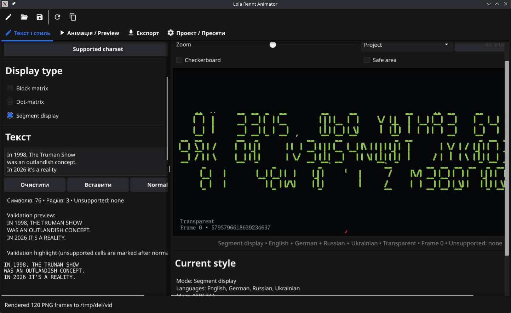
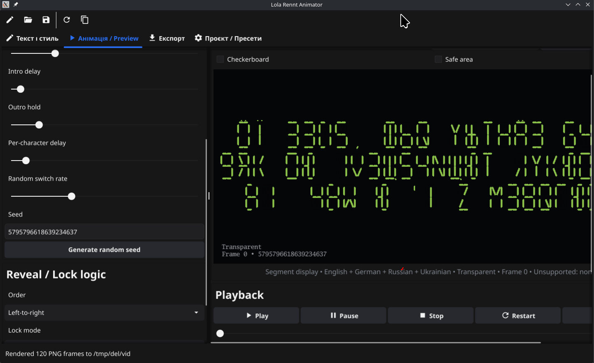
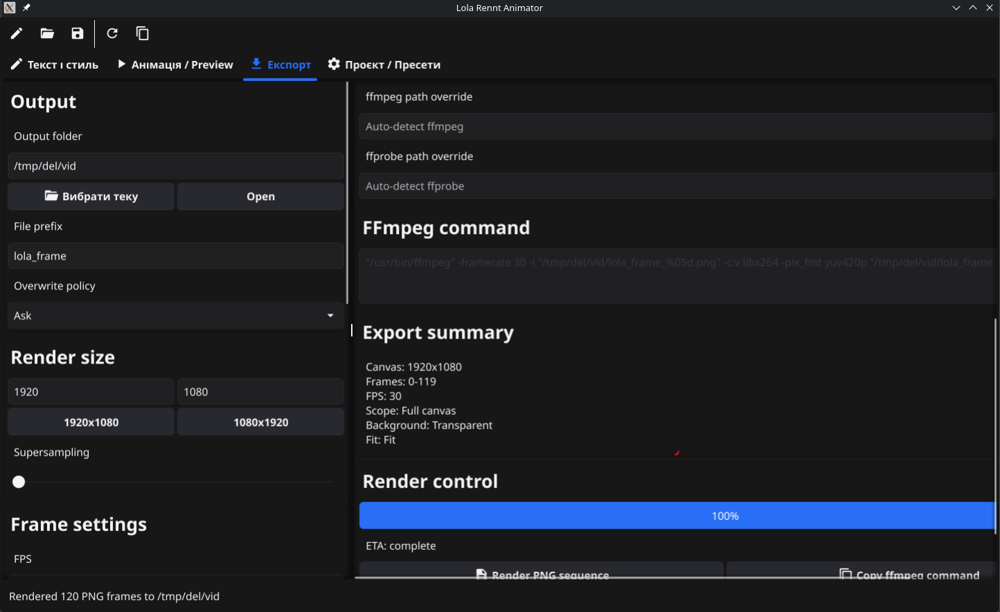
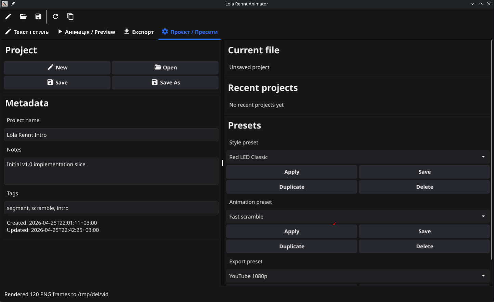

# Lola Rennt Animator

Desktop app for creating LED, dot-matrix, and segment-display text animations for titles, overlays, and motion graphics.

The app is written in Go with Fyne. It focuses on fixed-width electronic display typography, scramble/reveal animation, preview, project presets, and PNG sequence export with an FFmpeg command for final video assembly.

## Preview

### Screenshots









### Demo Videos

GitHub renders images inline reliably; the MP4 demos below are linked from preview thumbnails.

| Demo | Preview |
| --- | --- |
| [Segment animation demo 1](screenshots/lola_frame1.mp4) | [](screenshots/lola_frame1.mp4) |
| [Segment animation demo 2](screenshots/lola_frame2.mp4) | [](screenshots/lola_frame2.mp4) |
| [Segment animation demo 3](screenshots/lola_frame3.mp4) | [](screenshots/lola_frame3.mp4) |

## Features

- Display modes: `Block matrix`, `Dot-matrix`, and `Segment display`.
- Multi-line text input with uppercase workflow and validation preview.
- Character sets for English, German, Ukrainian, and Russian.
- Segment-style glyph rendering for Latin and Cyrillic text.
- Scramble/reveal animation with deterministic seed support.
- Style controls for color, glow, inactive segments, flicker, noise, and scanlines.
- Layout controls for scale, spacing, alignment, and padding.
- Background modes: transparent, solid color, gradient, image, and video.
- Preview with zoom, checkerboard, custom preview background, and safe-area overlay.
- Export to PNG sequence with configurable canvas, FPS, frame range, and supersampling.
- FFmpeg command generation for assembling rendered frames into video.
- Project save/load, recent projects, and style/animation/export presets.
- Native OS file and folder dialogs for project files, backgrounds, and output folders.

## Requirements

- Go `1.23.2` or newer.
- Fyne desktop runtime dependencies for your platform.
- FFmpeg and FFprobe are optional, but recommended for video background workflows and assembling exported frame sequences.

On Linux, Fyne desktop builds typically need CGO and native GUI/OpenGL headers. For Debian/Ubuntu-style systems, install packages equivalent to:

```bash
sudo apt install gcc pkg-config libgl1-mesa-dev xorg-dev libgtk-3-dev
```

Windows cross-builds from Linux require a MinGW-w64 cross compiler when CGO is enabled.

## Run From Source

```bash
go run .
```

## Build

Use the included Makefile for standard targets:

```bash
make linux
make windows
```

For a quick local compile without the default Makefile checks:

```bash
go build -o build/linux/lollarent .
```

The generated binary starts the Fyne desktop application.

## Basic Workflow

1. Enter text in the `Text and style` tab.
2. Choose a display mode and supported language set.
3. Adjust colors, glow, inactive segment visibility, effects, and layout.
4. Configure animation timing, seed, lock order, and playback.
5. Choose a background mode or keep the render transparent.
6. Set export size, frame range, output folder, and file prefix.
7. Render the PNG sequence.
8. Copy the generated FFmpeg command to assemble a video.

## Project Files

Projects are saved as JSON and include text, display settings, style, layout, animation, background, export settings, metadata, and seed. Reopening a project should reproduce the same preview and export when the same inputs and media paths are available.

## Export

The app renders frame sequences named like:

```text
lola_frame_00000.png
lola_frame_00001.png
...
```

It also generates an FFmpeg command similar to:

```bash
ffmpeg -framerate 30 -i "lola_frame_%05d.png" -c:v libx264 -pix_fmt yuv420p "lola_frame.mp4"
```

## Repository Layout

- `main.go`: Fyne application entry point.
- `app_ui.go`: desktop UI and user actions.
- `renderer.go`: image rendering pipeline.
- `segment_display.go`: explicit line-segment glyph renderer.
- `animation.go`: scramble and reveal animation logic.
- `export.go`: PNG sequence rendering.
- `background.go` and `video_background.go`: background image/video handling.
- `Docs/`: product spec and implementation notes.
- `screenshots/`: README screenshots and MP4 demo assets.

## Notes

The app is intended for stylized motion graphics and title work, not pixel-perfect emulation of one specific display device. Segment display mode is line-based, while block and dot-matrix modes use matrix glyph rendering.
